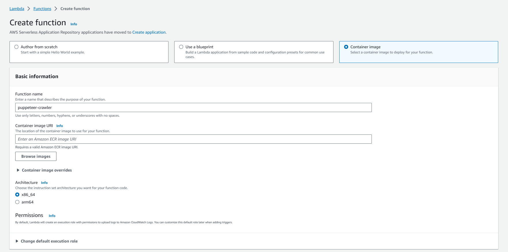
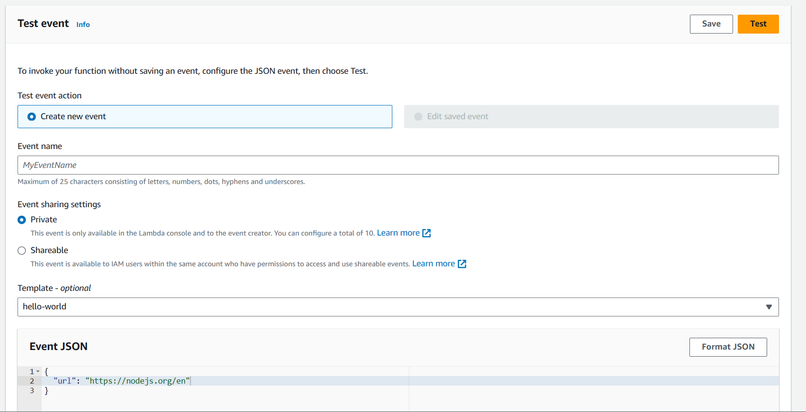
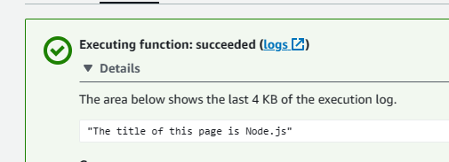

> Sound interesting. But why on earth should I use Docker instead of some simple lines of Python ?

## Use Cases
** OS configuration, proxy config, install additional software,... **

For normal Lambda, you can only install language-specific libraries, like Python's pip, Node's npm or Java's maven.

In this blog, we'll implement a [Crawler Lambda that must install Chrome driver at OS level with Puppeteer](https://pptr.dev/)

## Prerequisites
- Personal docker registry: DockerHub, AWS ECR,...

## Build image
```docker
# Dockerfile
FROM public.ecr.aws/lambda/nodejs:18

# Setup and install chromium
RUN yum install -y amazon-linux-extras
RUN amazon-linux-extras install epel -y
RUN yum install -y chromium

# skips puppeteer installing chrome and points to correct binary
ENV PUPPETEER_SKIP_DOWNLOAD=true \
    PUPPETEER_EXECUTABLE_PATH=/usr/bin/chromium-browser

COPY package*.json ./
RUN npm ci --omit=dev

# Copy function code
COPY index.js ${LAMBDA_TASK_ROOT}

# Set the CMD to your handler (could also be done as a parameter override outside of the Dockerfile)
CMD [ "index.handler" ]
```
Reference: https://docs.aws.amazon.com/lambda/latest/dg/nodejs-image.html#nodejs-image-instructions

```javascript
// index.js
const puppeteer = require('puppeteer');

exports.handler = async (event) => {
  // Launch the browser and open a new blank page
  const browser = await puppeteer.launch({
    headless: true,
    args: [
        '--no-sandbox',
        '--disable-setuid-sandbox',
        '--disable-dev-shm-usage',
        '--single-process',
    ],
  });
  const page = await browser.newPage();

  // Navigate the page to a URL
  await page.goto(event.url);

  const textSelector = await page.waitForSelector('head > title');
  const fullTitle = await textSelector?.evaluate(el => el.textContent);

  // Print the full title
  const message = `The title of this page is ${fullTitle}`
  console.log(message);

  await browser.close();

  return message;
}
```

Build and tag image
```bash
docker build -t lambda-docker-puppeteer:latest .
```

Create another tag with ECR repo. Make sure you have a repo name lambda-docker-puppeteer
```bash
docker tag lambda-docker-puppeteer:latest <YOUR_AWS_ACCOUNT_ID>.dkr.ecr.<YOUR_AWS_REGION>.amazonaws.com/lambda-docker-puppeteer:latest
```

## Publish to repository
> This post use ECR but the steps are similar to all docker repositories

Login with docker
```bash
aws ecr get-login-password --region us-east-1 | docker login --username AWS --password-stdin <YOUR_AWS_ACCOUNT_ID>.dkr.ecr.<YOUR_AWS_REGION>.amazonaws.com
```

Push image to ECR
```bash
docker push <YOUR_AWS_ACCOUNT_ID>.dkr.ecr.<YOUR_AWS_REGION>.amazonaws.com/lambda-docker-puppeteer:latest
```

## Create Lambda
Go to AWS Console > Create function > Choose Container image


> For puppeteer usage, we need a lot more than default computing and memory

Go to Configuration > General configuration > Modify 
1. Memory to at least 1024 MB
2. Timeout to at least 10 seconds

## Test run
Navigate to the Test tab and send this event
```json
{
  "url": "https://nodejs.org/en"
}
```


Congratulation, we have the final result !


## Source code
https://github.com/phuhung273/lambda-docker-puppeteer